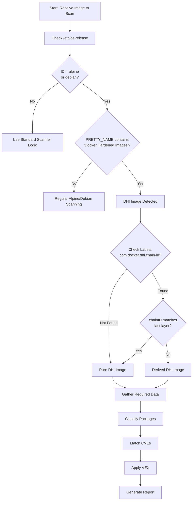
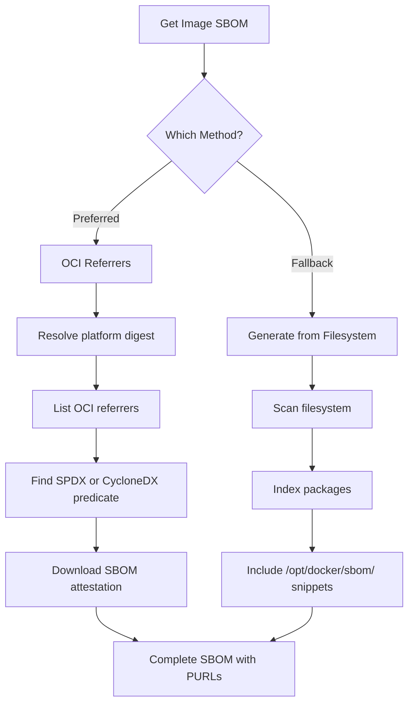
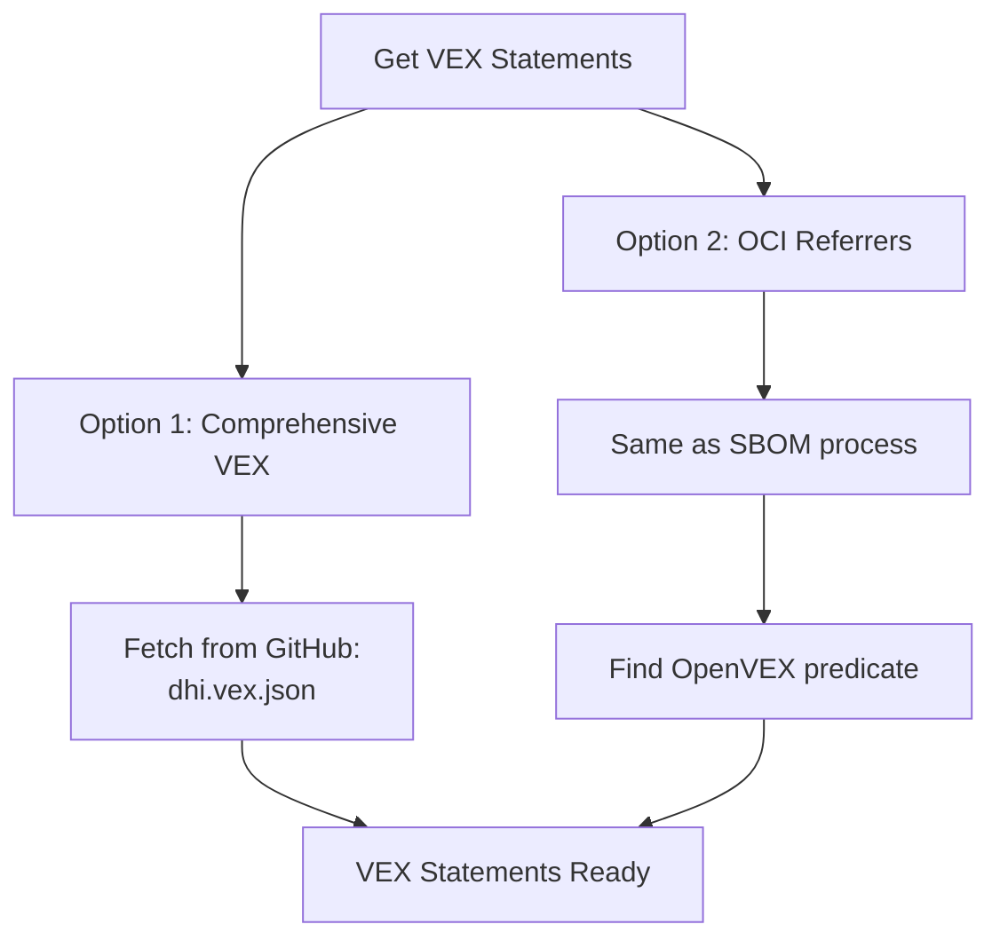
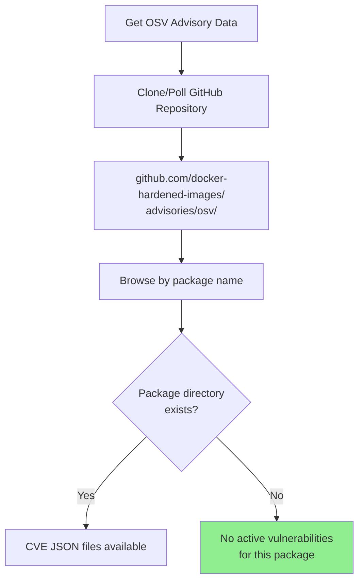
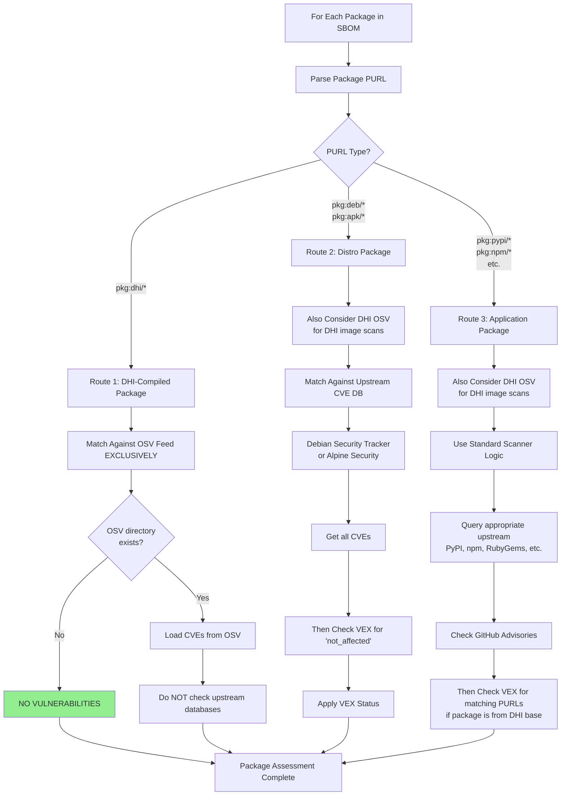
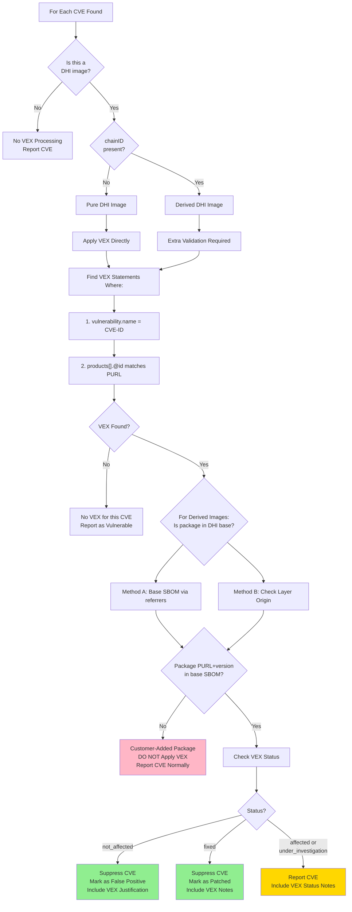
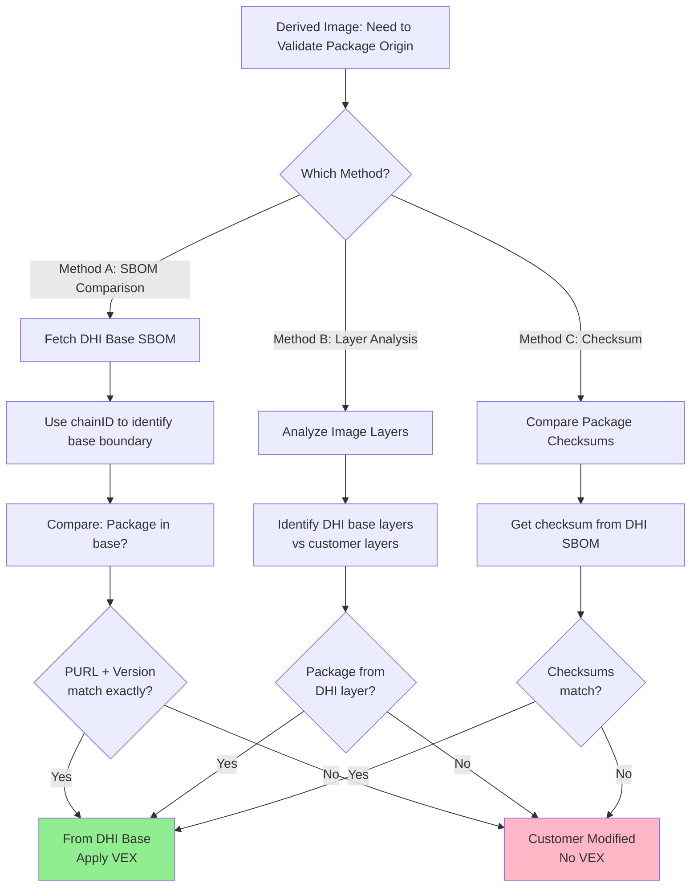
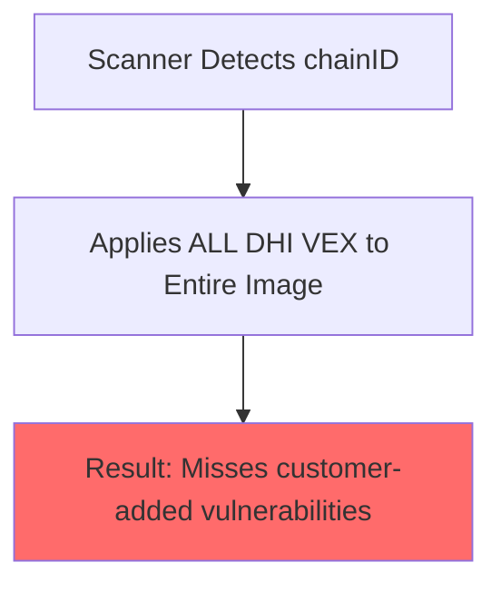
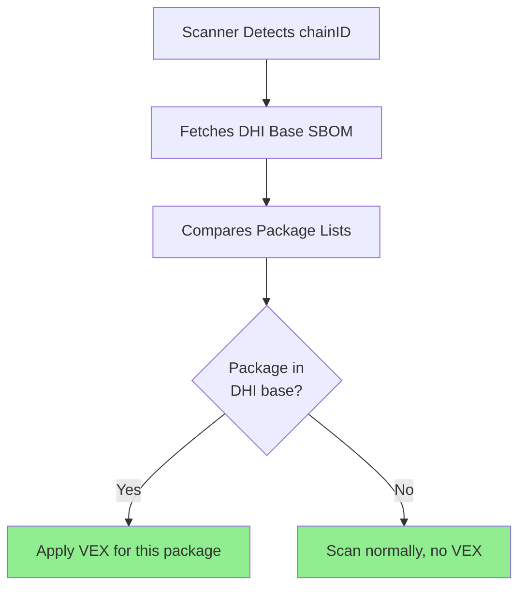

# DHI Scanner Integration: Decision Trees

This document provides visual flowcharts to guide scanner integration logic.

## Table of Contents

1. [Master Scanning Flow](#master-scanning-flow)
2. [Data Gathering](#data-gathering)
3. [Package Classification](#package-classification)
4. [VEX Application](#vex-application)
5. [Quick Reference Matrix](#quick-reference-matrix)

---

## Master Scanning Flow



---

## Data Gathering

### Step 1: SBOM Retrieval



### Step 2: VEX Retrieval



### Step 3: OSV Feed Access



---

## Package Classification



---

## VEX Application

### Critical: VEX Matching Logic



### Derived Image: Package Origin Check



---

## Quick Reference Matrix

### Package Routing Decision Table

| Package PURL Pattern | Advisory Source | VEX Source | Apply VEX? | Notes |
|---------------------|----------------|------------|-----------|-------|
| `pkg:dhi/python@*` | DHI OSV **ONLY** | DHI VEX | ✅ Always | Never check upstream |
| `pkg:dhi/node@*` | DHI OSV **ONLY** | DHI VEX | ✅ Always | Never check upstream |
| `pkg:deb/debian/openssl@*` | DHI OSV + Debian Security Tracker | DHI VEX | ✅ For DHI images | Upstream + DHI OSV + VEX overlay |
| `pkg:apk/alpine/musl@*` | DHI OSV + Alpine Security | DHI VEX | ✅ For DHI images | Upstream + DHI OSV + VEX overlay |
| `pkg:pypi/flask@*` (customer) | DHI OSV + PyPI, GitHub | DHI VEX (if in base SBOM) | ✅ If from DHI base | DHI scans include OSV consideration for all packages |
| `pkg:npm/express@*` (customer) | DHI OSV + npm, GitHub | DHI VEX (if in base SBOM) | ✅ If from DHI base | DHI scans include OSV consideration for all packages |

### VEX Status Actions

| VEX Status | Scanner Action | User Display | Include in Report? |
|-----------|---------------|--------------|-------------------|
| `not_affected` | Suppress CVE | False Positive | ✅ Yes (with justification) |
| `fixed` | Suppress CVE | Patched | ✅ Yes (with fix details) |
| `affected` | Report CVE | Vulnerable | ✅ Yes (with VEX notes) |
| `under_investigation` | Report CVE | Under Review | ✅ Yes (with status) |

### Image Type Detection

| Condition | Image Type | VEX Strategy |
|-----------|-----------|--------------|
| `/etc/os-release` ID=alpine/debian + PRETTY_NAME contains "Docker Hardened Images" + No chainID | Pure DHI | Direct VEX application |
| Same as above + chainID label present | Derived DHI | Validate package origin before VEX |
| `/etc/os-release` ID=alpine/debian + No "Docker Hardened Images" | Regular distro | No DHI VEX |

---

## Common Failure Modes

### ❌ Anti-Pattern: Naive VEX Application



**Problem**: Customer adds vulnerable `pkg:pypi/flask@2.0.0`, scanner incorrectly applies DHI VEX and suppresses the real vulnerability.

### ✅ Correct Pattern: Package-Specific VEX



**Solution**: VEX only applies to packages that exist unmodified from DHI base.

---

## Testing Your Logic

Use these test cases to validate your decision tree implementation:

1. **Pure DHI Image**: `dhi.io/python:3.13-alpine3.23@sha256:8061e30b8cfbf285c50a760486983eaec1e91925d3dc3fc1b801e5a40dfbbc51`
   - Should apply VEX to all `pkg:dhi/*` and `pkg:deb/*` packages
   
2. **Derived with Customer Packages**:
   ```dockerfile
   FROM dhi.io/python:3.13-alpine3.23@sha256:8061e30b8cfbf285c50a760486983eaec1e91925d3dc3fc1b801e5a40dfbbc51
   RUN pip install flask==2.0.0  # Has known CVE
   ```
   - Should apply VEX to DHI packages
   - Should report CVE in flask (no VEX)

3. **Multi-stage (No DHI in Final)**:
   ```dockerfile
   FROM dhi.io/python:3.13-alpine3.23@sha256:8061e30b8cfbf285c50a760486983eaec1e91925d3dc3fc1b801e5a40dfbbc51 AS builder
   FROM ubuntu:22.04
   COPY --from=builder /app /app
   ```
   - Should not apply any DHI VEX (no DHI packages in final image)

4. **Modified DHI Package**:
   - Customer replaces `pkg:dhi/python@3.13` with custom build
   - PURL changes, VEX won't match → correct behavior

---

## Next Steps

- 🧪 Test with [Example Images](../examples/)
- ✅ Validate with [Test Suite](../validation/test-suite.md)
- 💻 Review the [Go Reference Implementation](../reference-implementations/go/)

---

**Questions?** Check the [FAQ](faq.md).
