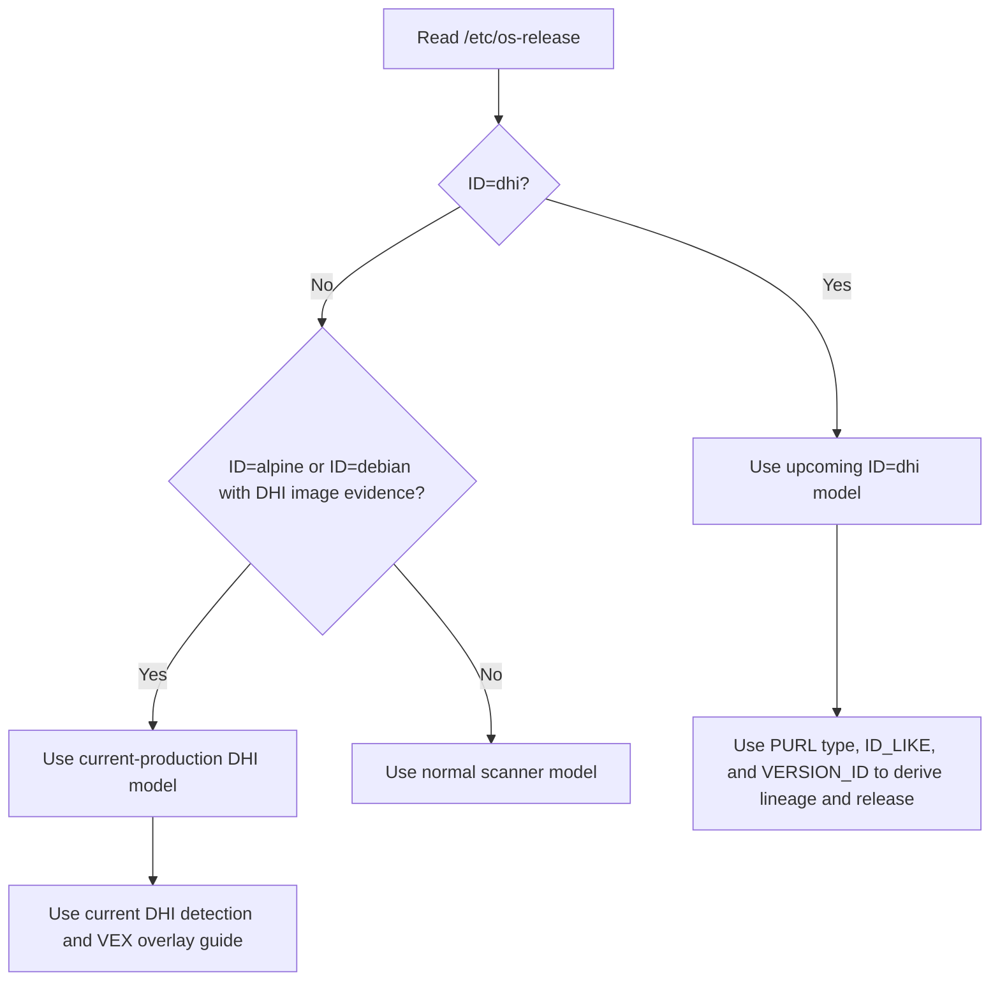
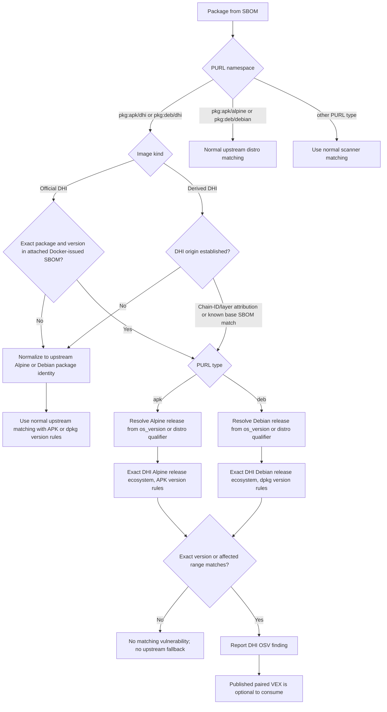
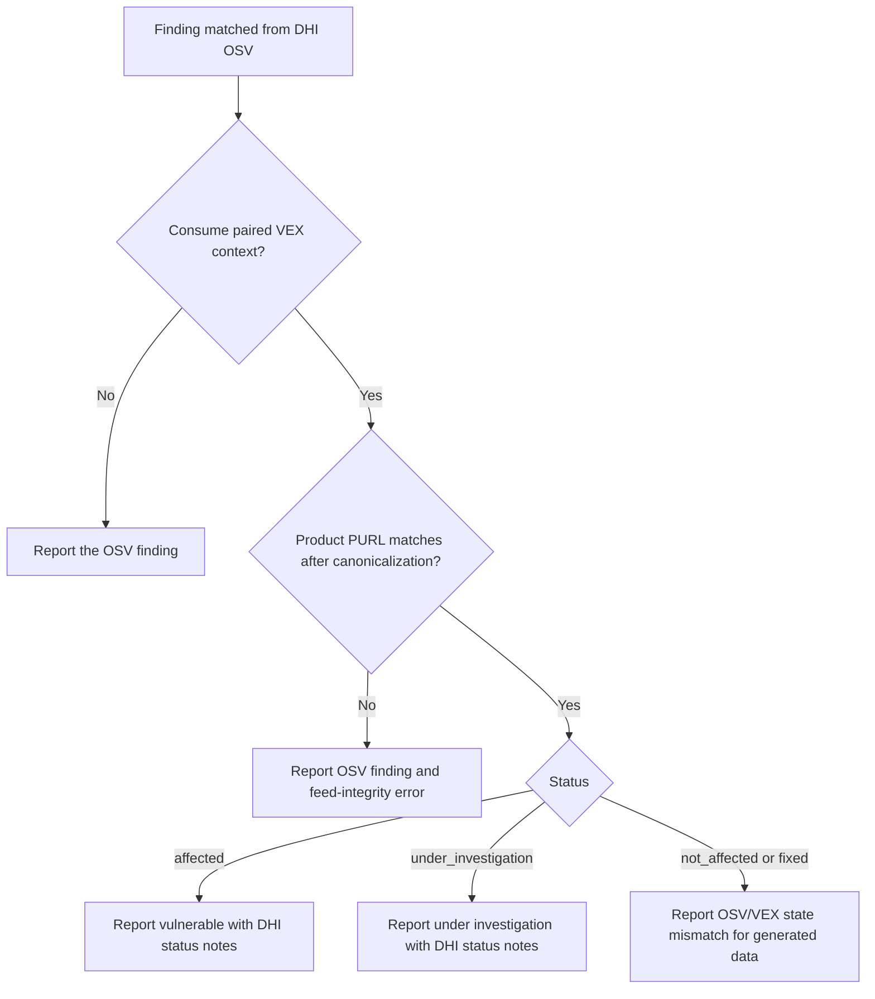
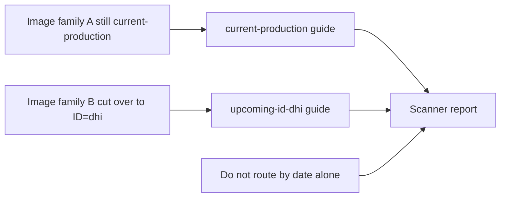

# Decision Trees

## Image Model Detection

## Package Advisory Routing

## VEX Context

For an `under_investigation` assessment, generated DHI OSV lists the exact
package versions covered by the current assessment. The VEX branch labels an
existing OSV finding as unresolved; it does not create the finding.

## Mixed Production Cutover

