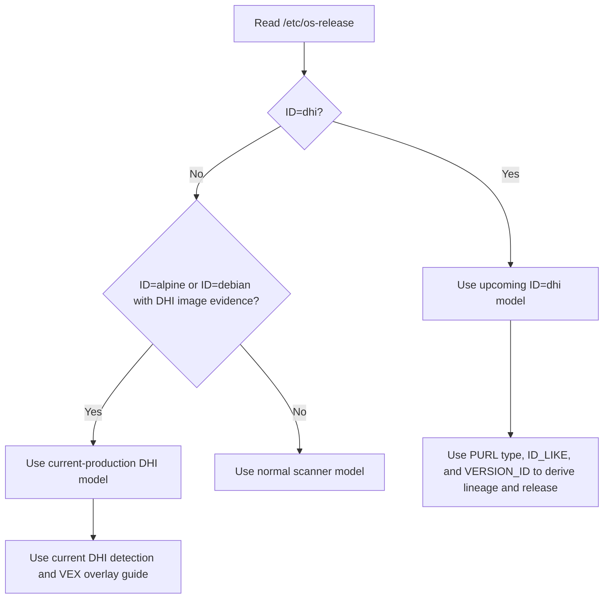
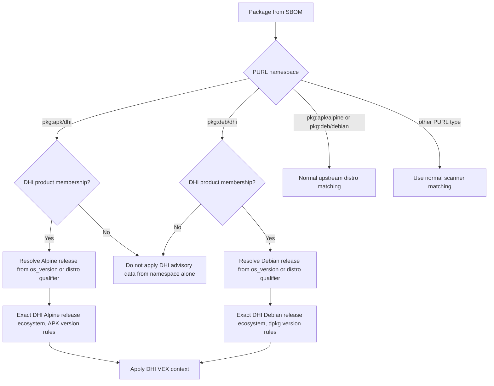
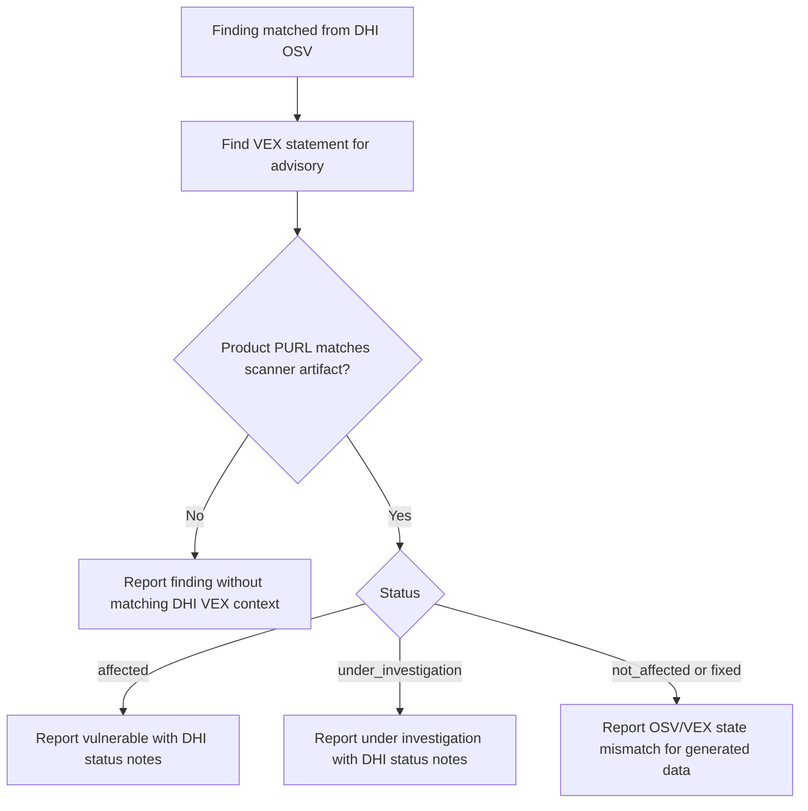
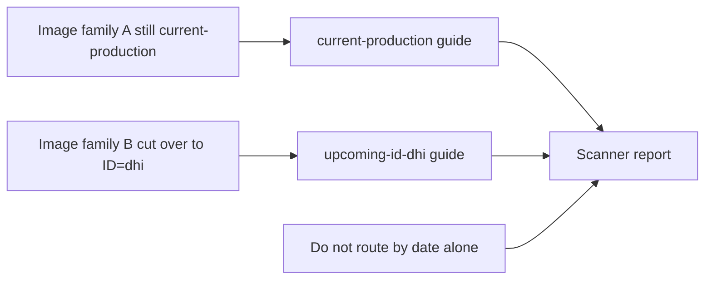

# Decision Trees

## Image Model Detection

```mermaid
flowchart TD
  A[Read /etc/os-release] --> B{ID=dhi?}
  B -->|Yes| C[Use upcoming ID=dhi model]
  B -->|No| D{ID=alpine or ID=debian with DHI image evidence?}
  D -->|Yes| E[Use current-production DHI model]
  D -->|No| F[Use normal scanner model]
  C --> G[Use PURL type, ID_LIKE, and VERSION_ID to derive lineage and release]
  E --> H[Use current DHI detection and VEX overlay guide]
```

## Package Advisory Routing

```mermaid
flowchart TD
  A[Package from SBOM] --> B{PURL namespace}
  B -->|pkg:apk/dhi| C{DHI product membership?}
  B -->|pkg:deb/dhi| D{DHI product membership?}
  B -->|pkg:apk/alpine or pkg:deb/debian| E[Normal upstream distro matching]
  B -->|other PURL type| F[Use normal scanner matching]
  C -->|Yes| K[Resolve Alpine release from os_version or distro qualifier]
  C -->|No| J[Do not apply DHI advisory data from namespace alone]
  D -->|Yes| L[Resolve Debian release from os_version or distro qualifier]
  D -->|No| J
  K --> G[Exact DHI Alpine release ecosystem, APK version rules]
  L --> H[Exact DHI Debian release ecosystem, dpkg version rules]
  G --> I[Apply DHI VEX context]
  H --> I
```

## VEX Context

```mermaid
flowchart TD
  A[Finding matched from DHI OSV] --> B[Find VEX statement for advisory]
  B --> C{Product PURL matches scanner artifact?}
  C -->|No| D[Report finding without matching DHI VEX context]
  C -->|Yes| E{Status}
  E -->|affected| F[Report vulnerable with DHI status notes]
  E -->|under_investigation| G[Report under investigation with DHI status notes]
  E -->|not_affected or fixed| H[Report OSV/VEX state mismatch for generated data]
```

## Mixed Production Cutover

```mermaid
flowchart LR
  A[Image family A still current-production] --> B[current-production guide]
  C[Image family B cut over to ID=dhi] --> D[upcoming-id-dhi guide]
  B --> E[Scanner report]
  D --> E
  F[Do not route by date alone] --> E
```
